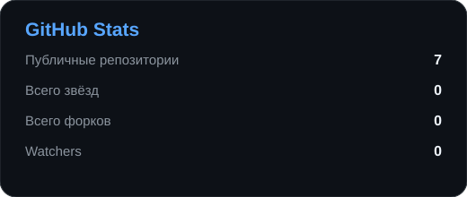
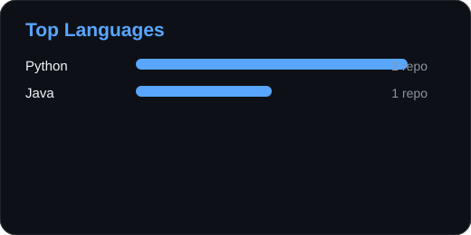

<div align="center">


### Разработчик • Создаю свои проекты • Постоянно учусь

Мне нравится создавать программы, экспериментировать с технологиями и превращать идеи в работающие проекты.

<br>

[](https://git.io/typing-svg)

<br>

[](https://grxt.dev)
[](https://github.com/Gr1xzz11)


</div>

---

## 👨‍💻 Обо мне

- Программированием занимаюсь уже **более 4 лет**
- Основные языки — **Python и Java**
- Разрабатываю приложения для **Linux, Windows и Android**
- Работаю с backend, API, серверной инфраструктурой и сетевыми инструментами
- Люблю не просто изучать технологии, а применять их в реальных проектах

---

## 🛠 Языки и инструменты

<div align="center">


</div>

---

## ◈ Проекты

<table>
<tr>
<td width="50%" valign="top">

### 🌐 [GRXT WS Proxy](https://github.com/Gr1xzz11/GRXT-WS-Proxy)

Android/network-проект GRXT для работы с сетевыми подключениями и диагностикой.

`Android` `Network` `GRXT`

</td>
<td width="50%" valign="top">

### 🛡️ [BanHelper](https://github.com/Gr1xzz11/BanHelper)

Инструменты и автоматизация для работы с модерацией и отчётами.

`Python` `Desktop` `Automation`

</td>
</tr>
<tr>
<td width="50%" valign="top">

### 📁 [FileSorter](https://github.com/Gr1xzz11/FileSorter)

Утилита для автоматической сортировки и организации файлов.

`Python` `Utility`

</td>
<td width="50%" valign="top">

### ◈ [GRXT](https://grxt.dev)

Мои приложения, инструменты и инфраструктура под единым названием GRXT.

`Desktop` `Mobile` `Backend` `Network`

</td>
</tr>
</table>

---

## ⚡ Сейчас в фокусе

- развитие проектов **GRXT**
- Android и desktop-приложения
- backend, API и собственная инфраструктура
- автоматизация сборок и публикаций через GitHub Actions

---

## 📊 GitHub Stats

<div align="center">




</div>

---

## 🐍 Активность

<div align="center">

<picture>
  <source media="(prefers-color-scheme: dark)" srcset="https://raw.githubusercontent.com/Gr1xzz11/Gr1xzz11/output/github-contribution-grid-snake.svg" />
  <source media="(prefers-color-scheme: light)" srcset="https://raw.githubusercontent.com/Gr1xzz11/Gr1xzz11/output/github-contribution-grid-snake-light.svg" />
  
</picture>

</div>

---

## 🚀 Чем занимаюсь

```text
Разработка
├── Python
├── Java
├── Android
├── Desktop
└── Web / API

Инфраструктура
├── Linux
├── VPS
├── Nginx
├── MySQL
└── GitHub Actions
```

---

<div align="center">

### ◈ GRXT

**Программы • инструменты • инфраструктура**

🌐 [grxt.dev](https://grxt.dev)

<br>

<sub>Создавать. Экспериментировать. Развиваться.</sub>


</div>
